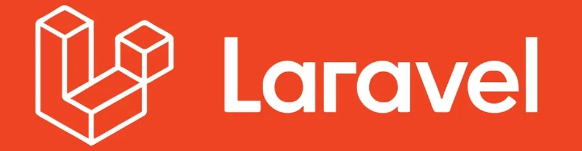

# 🎯 Laravel/framework vulnerabilities

  
  
 

Laravel, as one of the most popular PHP frameworks, provides a lot of built-in security features, but like any software, it is not immune to security vulnerabilities. Over time, various security issues have been discovered in Laravel, although many have been patched. Some of the common vulnerabilities or security pitfalls in Laravel and similar frameworks, if not managed properly, include:

# 1. SQL Injection

**Vulnerability:** SQL injection occurs when untrusted input is embedded directly into SQL queries. In the past, Laravel was vulnerable to SQL injection if developers didn't use the framework's query builder or Eloquent ORM correctly.
**Laravel Protection:** Laravel uses parameterized queries, which makes it immune to basic SQL injection attacks when using Eloquent ORM or the query builder.
**However:** Direct use of raw queries without proper escaping or validation can still introduce vulnerabilities.

**Prevention:**

- Always use Eloquent ORM or Laravel's query builder.

- Avoid raw queries if possible.

- If raw queries are necessary, use query parameter binding `($query->where('column', '=', $value))`.

# 2. Cross-Site Scripting (XSS)

**Vulnerability:** XSS attacks happen when an attacker injects malicious scripts (usually JavaScript) into a web page that is viewed by other users.
**Laravel Protection:** Laravel provides built-in functions such as `{{ }}` for escaping output in views, which automatically converts special characters to HTML entities.
**However:** Developers may forget to escape output in places outside of views, like in custom HTML generation, or fail to escape user-generated content.

- Use the `{{ }}` blade syntax for escaping variables.

- Avoid echoing raw HTML or JavaScript in views.

- Use a content security policy (CSP) to mitigate the risk of inline scripts.

  # 3. Cross-Site Request Forgery (CSRF)

**Vulnerability:** CSRF attacks involve tricking a logged-in user into performing actions they did not intend, like transferring money or changing account settings.
**Laravel Protection:** Laravel includes built-in CSRF protection for forms and AJAX requests. It automatically checks for a CSRF token in forms and in AJAX requests.
**However:** Disabling or bypassing CSRF protection, especially in custom routes or APIs, can introduce vulnerabilities.

**Prevention:**

- Always use the `@csrf` Blade directive in forms.

- Use `X-CSRF-TOKEN` headers for AJAX requests.

- Avoid disabling CSRF protection unless necessary.

 # 4. Insecure Direct Object References (IDOR)

 **Vulnerability:** IDOR occurs when an attacker can directly access and manipulate objects or resources (like user accounts or documents) by manipulating URL parameters or form fields.
**Laravel Protection:** Laravel does not automatically prevent IDOR, but it provides tools like route model binding and authorization gates to restrict access to resources based on permissions.
**However:** Developers may forget to implement proper access controls on routes or controllers.

**Prevention:**

- Always ensure proper authorization checks are in place before accessing sensitive resources.

- Use route model binding and ensure the authenticated user has permission to access the resource.

# 5. Sensitive Data Exposure

**Vulnerability:** This happens when sensitive information (such as passwords or API keys) is stored or transmitted in an insecure manner.
**Laravel Protection:** Laravel includes several encryption features, such as AES-256 encryption for storing sensitive data and the ability to hash passwords securely using bcrypt.
**However:** Storing passwords or sensitive data in plain text or not using proper encryption for database fields could lead to vulnerabilities.

**Prevention:**

- Always hash passwords with Laravel's `bcrypt()` or `argon2` hashing functions.

- Use SSL/TLS for securing data in transit (HTTPS).

- Ensure sensitive data is encrypted before being stored in the database.

# 6. Improper Access Control

**Vulnerability:** Improper access control occurs when users can access resources or perform actions that they shouldn't be allowed to, such as an unauthenticated user accessing a protected route.
**Laravel Protection:** Laravel's built-in authentication system and middleware ensure that users can only access routes they are authorized to.
**However:** Developers may improperly configure middleware or neglect to add access control checks to custom routes or controllers.

**Prevention:**

- Use Laravel’s

- Protect routes with appropriate middleware (`auth, admin, role, etc.`)

- Alway

# 7. File U

**Vulnerabi: Al**
**Laravel Protection:** Laravel provides methodsmimes, max, image,
**However: If file**

**Prevention:**

- Validate file types and sizes rigorously `($request->file('file')->isValid())`.

- S

- If necessary, use Laravel’s Storage::put method to s

# 8. Broken Authentication

**Vulnerability:**

- Laravel Prot: Laravel p

- How: Developers

**Prevention:**

- Use Laravel’s buil

- Implemen

- Use HT

# 9. Securit

**Vulnerabil:** A security misconAPP_DEBUG setting enabled

**Laravel Pr:** Laravel has r

**Howev:** DevelopersAPP_DEBUG) in prod_storage/ and vendor/.

**Prevention:**

- Disable APP_DEBUG in pro_APP_DEBUG=false in `.env.env).

- Secure

- Keep Lar

# 10. Open Redirect

**Vuln:** Open redirects happen when an attacker tricks a user into being redirected to a malicious site through an unsuspecting URL parameter.
**Laravel Protec:** Laravel does not inherently protect against open redirects, but developers can control redirects to ensure users are only redirected to trusted **locations.**
**However:** Developers

**Pre:**

- Valida

- Avoid dynamically redirecting to URLs based on user input unless you strictly control them.

# Example of XSS Vulnerability in Laravel:

Let's say you have a simple Laravel application where users can leave comments on blog posts. If a user enters a comment that includes JavaScript code, and you display it directly without sanitizing or escaping the output, an attacker could inject malicious scripts.

# Vulnerable Code (Example of Stored XSS):
PHP
~~~ruby
// Controller method to show comments
public function showComments($postId)
{
    $comments = Comment::where('post_id', $postId)->get();

    return view('post.show', compact('comments'));
}
~~~
HTML
~~~ruby
<!-- Blade view (post/show.blade.php) -->
@foreach($comments as $comment)
    
{{ $comment->content }}
 <!-- Vulnerable to XSS -->
@endforeach
~~~

***How it works:***

In the above example, if a user submits the following comment:
script
~~~ruby

~~~

When the comment is displayed, the script will execute, causing an alert box to pop up with the message `"You have been hacked!"`.

# Impact:

- If the attacker injects malicious JavaScript code, they can perform actions like stealing session cookies, redirecting users to phishing sites, or even making unauthorized requests on behalf of the user.

# Fixing the Vulnerability:

To prevent XSS in Laravel, always escape user input before displaying it. Laravel provides a safe way to do this using the Blade templating engine.

***Safe Output with Blade (Escaping Input):**
HTML
~~~ruby
<!-- Blade view (post/show.blade.php) -->
@foreach($comments as $comment)
    
{{ $comment->content }}
 <!-- Now safely escaped -->
@endforeach
~~~

By using the `{{ }}` syntax in Blade, Laravel automatically escapes any HTML, preventing it from being executed in the browser.

If you need to display raw HTML (which should be avoided unless absolutely necessary), you can use `{!! !!}` syntax, but **only if you're sure the content is safe**

# Example (Unsafe raw output):
PHP
~~~ruby

{!! $comment->content !!}
 <!-- Risky if input is not sanitized -->
~~~
In this case, you should be **absolutely sure** the content is sanitized before displaying it.

# Example of Reflected XSS:

Reflected XSS occurs when a user sends data via a URL or form, and the server reflects it back without sanitizing it.

**Vulnerable Code (Example of Reflected XSS):**
PHP
~~~ruby
// Controller method to process the query
public function search(Request $request)
{
    $query = $request->input('query');
    return view('search.results', compact('query'));
}
~~~
HTML
~~~ruby
<!-- Blade view (search/results.blade.php) -->
<h1>Search results for: {{ $query }}</h1> <!-- Vulnerable to XSS -->
~~~
In this case, if the user visits a URL like:
PHP
~~~ruby
http://yourapp.com/search?query=
~~~

The script will execute when the search results page is displayed, causing an alert.

**Fixing Reflected XSS:**
HTML
~~~ruby
<h1>Search results for: {{ $query }}</h1> <!-- Safe with Blade escaping -->
~~~

# Preventing XSS in Laravel:

**1.Always escape output:** Use `{{ }}` in Blade to ensure user input is safely escaped.

**2.Sanitize user input:** If you're allowing users to submit HTML, use a package like HTMLPurifier to sanitize it and remove malicious content.

**3.Use Content Security Policy (CSP)**: Implement a Content Security Policy in your HTTP headers to restrict the sources from which scripts can be loaded.

**4.Use Laravel's built-in validation:** For forms, always validate user input using Laravel’s built-in validation rules to ensure only expected data is accepted.

**5.Avoid eval() and innerHTML:** Don't use JavaScript's eval() or innerHTML in your front-end code, as these can execute injected scripts.

# Summary:

- XSS attacks can be devastating if an attacker can inject JavaScript into your web application. To mitigate the risk:

- Use Laravel's Blade templating engine to safely escape output.

- Avoid raw output unless absolutely necessary, and always sanitize it.

- Implement security headers like Content Security Policy (CSP).

- Validate and sanitize all user input thoroughly.

# Summary of Key XSS Protection Strategies:

- Escape all user-generated content using Blade's {{ }} syntax.

- Sanitize input when raw HTML is necessary using libraries like HTMLPurifier.

- Use textContent and avoid innerHTML to prevent client-side JavaScript injection.

- Enforce Content Security Policy (CSP) for an additional layer of defense.

- Regularly validate user input to ensure only valid data is accepted.

- With these practices, you can significantly reduce the risk of XSS vulnerabilities in your Laravel application.

  # Conclusion

  Security is an ongoing process that requires vigilance, expertise, and adherence to best practices. For Laravel applications, relying solely on default security features is not enough. Implementing a robust security strategy, conducting regular audits, and staying informed about emerging threats is essential to protecting both the application and its users from the consequences of ineffective security protocols.The reality is that Laravel, while robust, cannot guarantee security on its own. Developers must stay proactive by combining Laravel’s built-in features with industry-standard security protocols and best practices. A secure Laravel application is not just about using the right tools, it’s about cultivating a **security-first mindset** and continuously evolving to stay ahead of potential threats.

> [!WARNING]
> Warning: For informational purposes only, we do not recommend using illegal actions. Please note potential issues and possible alternative solutions.
